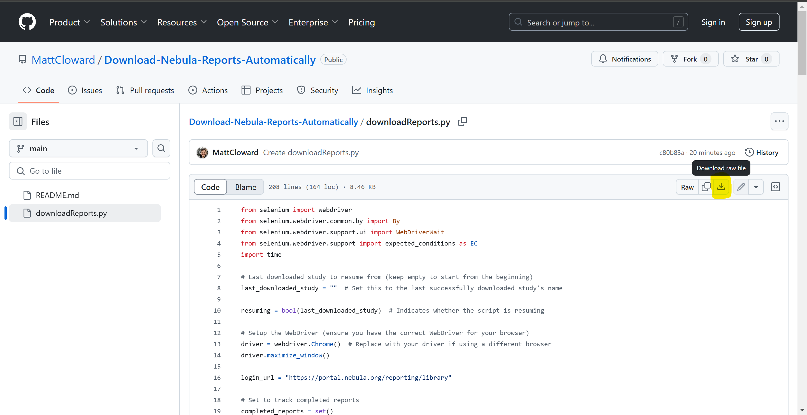

# Download Nebula Reports Automatically
Like many of you, I'm deeply upset that Nebula Genomics decided to change their name so they could cancel our lifetime subscriptions. After the way they've treated us, I have no interest in switching to their new platform and I don't intend to give them any more money. If you feel the same way, these tutorials are for you! I am assembling resources to smoothly break ties with them. These resources include:
1. **Tool to automatically download all 350 reports automatically as PDFs**
2. **Tutorials for free access to their "Gene Analysis" and "Genome Browser" tools.**
3. **More resources to come...**

I hope these tutorials help you decide not to make the switch to Complete Genomics. Feel free to ask me any questions by opening an issue on this repository, or emailing me at mattcloward@gmail.com

## 1. Auto download Nebula Genomics reports
If you only want the percentile results for your reports (minimum results), scroll to the bottom of the page until no new reports appear, then right-click, click save-as, then save it as an mhtml file. You can follow these steps to download your traits and microbiome data as well.

If you want your full results for each of your 350 reports, use the "downloadReports.py" Python script in this repository to automatically download all of Nebula Genomics' reports as PDFs. The script opens a Chrome window and simulates clicks to download all the reports while you continue to use your computer!
Note: I have only tested this on Windows, but I suspect it should work on Mac and Linux too.
### Setup
1. Download the "downloadReports.py" file. Click on the file in GitHub, then click the "Download raw file" button. Save the file anywhere on your computer.

2. Install Python3 if you don't already have it (find a tutorial online).
3. Open a command line terminal to the directory where you stored the "downloadReports.py" file (look up a tutorial).
4. Install the "selenium" module using either of the following two commands:
- pip install selenium
- python3 -m pip install selenium
### Running the script
1. Run the file using the following command: python3 downloadReports.py
2. A Chrome window will open up to the login page for Nebula: enter your credentials and two-factor authentication (this is completely safe since only Nebula gets your credentials).
3. After a few downloads, Chrome will ask you if you want to allow multiple downloads. Hit "Allow".
4. Sit back and relax. Your reports are now downloading automatically!

If for any reason the script is interrupted, you can pick up where you left off.
1. Open "downloadReports.py" in a text editor.
2. Between the quotation marks next to the "last_downloaded_study" variable, paste the name of the last PDF that was downloaded. ex: Corneal distrophy (Bryan R. Gorman, 2024)
3. Run the script again and it will skip the studies already downloaded.

### Notes:
1. The combined 350 PDF files are about 2 GB. They will download to your downloads folder, but you can move them to a better place.
2. It will take some time to download all reports because it's simulating user clicks and includes long pauses to ensure files are downloaded correctly.
3. You can still use your computer while the script runs.
4. If you don't have Chrome installed, edit the script and replace "Chrome" with your browser of choice.
5. Disclaimer: I used ChatGPT to generate this code, iteratively testing its code and requesting new features.

## 2. Don't Switch to Complete Genomics: Use Nebula’s Tools in Your Browser for Free (Works For All CRAM and VCF Files)
I use Nebula's Gene Analysis and Genome Browser tools a lot for my PhD research and was sad I'd be losing access to them. But I discovered today that you can still use them completely for free if you have your data saved on your computer. Here's how:

### GENE ANALYSIS TOOL
Nebula's Gene Analysis tool is based on gene.iobio, a free tool available at [https://gene.iobio.io/](https://gene.iobio.io/)

To replicate the Gene Analysis tool completely for free:
1. Go to [https://gene.iobio.io/](https://gene.iobio.io/)
2. Click load your data button (center of the page)
3. Hit the "Separate URL for index" switch (top left of the popup window)
4. Click "Choose files" next to the "Enter vcf URL" section
5. Select your vcf.gz and vcf.gz.tbi files from your computer (control-click to select multiple files)
6. Wait for the file to load (it's really fast)
7. Click the now blue "Load" button
8. You're all set! Use this site just like you would use Nebula's Gene Analysis tool!

One neat feature of gene.iobio on this site, that Nebula doesn’t do, is that you can load your VCF AND CRAM files to see your variants and their read depth.

### GENOME BROWSER
Nebula's Genome Browser is based on the Broad Institute’s Integrative Genomics Viewer (IGV), another free tool available at [https://igv.org/](https://igv.org/)

To replicate the Genome Browser tool completely for free:
1. Go to [https://igv.org/](https://igv.org/)
2. Click IGV Web App (center of the page)
3. In the top left corner, click "Tracks", then "Local File"
4. Select your cram and cram.crai files from your computer (control-click to select multiple files)
5. You're all set! Use this site just like you would use Nebula's Genome Browser tool!

The best part about the IGV Web Browser is that you don’t have to wait 2 days every time Nebula unloads your data. It's fast and accessible whenever you need it!

## 3. Other Resources
TBD- let me know what you'd like to see by opening an issue on this repository or emailing me at mattcloward@gmail.com

